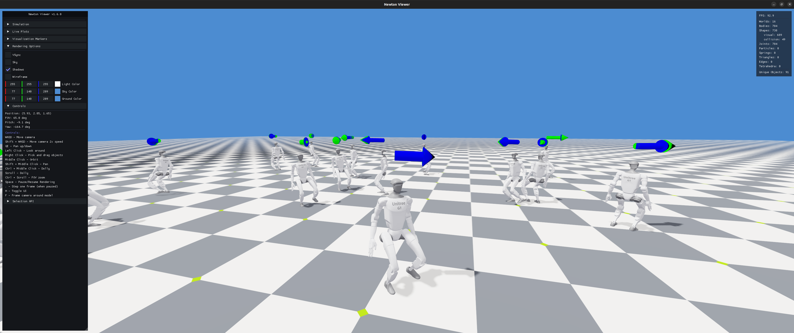

# g1_locomotion

An external Isaac Lab project for training Unitree G1 humanoid locomotion on the **Newton** physics backend — nothing
more, nothing less. It is not a framework or a general-purpose library: it is Isaac Lab's own G1 velocity-locomotion
task, repackaged as a single installable package that lives outside the Isaac Lab tree. See
[License and attribution](#license-and-attribution) for exactly what is upstream code and what is not.

| | |
| --- | --- |
| Isaac Lab | [`release/3.0.0`](https://github.com/isaac-sim/IsaacLab/tree/release/3.0.0), consumed as an editable source checkout |
| Physics | Newton (`newton_mjwarp` by default); PhysX presets exist only as a fallback |
| Robot | Unitree G1 |
| Scope | Velocity-tracking locomotion on flat and rough terrain |
| Layout | Standard uv `src` layout, so it trains without an Isaac Sim installation |



*`Unitree-G1-Velocity-Newton-Flat` played back in the Newton viewer; blue arrows are the commanded base velocities,
green arrows the tracked ones.*

Registered tasks:

| Task | Terrain | Default iterations | Log folder |
| --- | --- | --- | --- |
| `Unitree-G1-Velocity-Newton-Flat` | flat plane | 1500 | `logs/rsl_rl/g1_flat` |
| `Unitree-G1-Velocity-Newton-Rough` | procedural rough terrain + height scanner | 5000 | `logs/rsl_rl/g1_rough` |

Both are manager-based `ManagerBasedRLEnv` tasks with 4096 environments, a 200 Hz simulation step (`sim.dt = 0.005`)
decimated by 4 to a 50 Hz control rate, and 20 s episodes. The default RL library is `rsl_rl`; skrl configs are
registered as well.

## Installation

Install [uv](https://docs.astral.sh/uv/getting-started/installation/), then create the project environment. The default
environment uses the Newton backend and does **not** install Isaac Sim:

```bash
uv sync
```

This project depends on an Isaac Lab source checkout through editable relative paths in `[tool.uv.sources]`
(`../IsaacLab-v3.0.0`, the `release/3.0.0` branch). Update those paths if either directory moves; other Isaac Lab
versions are not tracked here.

Optional backends are available through extras. Pass the extra to each `uv run` command that needs it:

```bash
# Standalone OV PhysX
uv run --extra ovphysx isaaclab random_agent --task Unitree-G1-Velocity-Newton-Flat physics=ovphysx

# Isaac Sim with PhysX and RTX rendering
uv run --extra isaacsim isaaclab random_agent --task Unitree-G1-Velocity-Newton-Flat physics=isaacsim_physx
```

The `ov` extra installs both the `ovphysx` and `ovrtx` runtimes. Commit `pyproject.toml` and `uv.lock` so collaborators
use the same environment.

## Train on Newton

Newton (`newton_mjwarp`) is the default physics backend for these tasks, so no `physics=` override is needed. Start with
the flat task — it converges in roughly 1500 iterations and is the fastest way to confirm the setup works:

```bash
# Check that the tasks are registered and see the available backends
uv run python scripts/list_envs.py --show_presets

# Train the flat policy (headless; no viewer is opened unless one is requested)
uv run isaaclab train --rl_library rsl_rl --task Unitree-G1-Velocity-Newton-Flat

# Watch the trained policy
uv run isaaclab play --rl_library rsl_rl --task Unitree-G1-Velocity-Newton-Flat \
    --checkpoint latest --num_envs 32 --visualizer newton
```

Rough terrain reuses the same rewards plus a height scanner on `torso_link` and a terrain-level curriculum:

```bash
uv run isaaclab train --rl_library rsl_rl --task Unitree-G1-Velocity-Newton-Rough
```

Useful flags while iterating:

```bash
# Short smoke run on few environments
uv run isaaclab train --rl_library rsl_rl --task Unitree-G1-Velocity-Newton-Flat \
    --num_envs 64 --max_iterations 5

# Open the Newton viewer during training (slower; cap the drawn environments)
uv run isaaclab train --rl_library rsl_rl --task Unitree-G1-Velocity-Newton-Flat \
    --num_envs 64 --visualizer newton --max_visible_envs 16

# Record videos, name the run, pick a logger
uv run isaaclab train --rl_library rsl_rl --task Unitree-G1-Velocity-Newton-Flat \
    --video --run_name baseline --logger tensorboard

# Multi-GPU
uv run isaaclab train_multigpu --rl_library rsl_rl --task Unitree-G1-Velocity-Newton-Rough --num_gpus 2
```

Checkpoints and TensorBoard event files land in `logs/rsl_rl/<experiment_name>/<timestamp>/`:

```bash
uv run tensorboard --logdir logs/rsl_rl
```

To exercise an environment without a policy — the quickest check that the scene and Newton solver come up:

```bash
uv run isaaclab zero_agent --task Unitree-G1-Velocity-Newton-Flat --num_envs 16
uv run isaaclab random_agent --task Unitree-G1-Velocity-Newton-Flat --num_envs 16
```

## Physics backends

`list_envs.py --show_presets` prints the presets defined in `RoughPhysicsCfg`. Select one with a Hydra-style
`physics=<PRESET>` override (no leading dashes):

| Preset | Backend | Notes |
| --- | --- | --- |
| `newton_mjwarp` | Newton, MuJoCo-Warp solver | **Default.** `implicitfast` integrator, pyramidal cone, 2 substeps |
| `newton_kamino` | Newton, Kamino PADMM solver | Contact-rich alternative |
| `physx` | PhysX, auto-selected runtime | Resolves to `isaacsim_physx` or `ovphysx` |
| `isaacsim_physx` | PhysX inside Isaac Sim | Requires the `isaacsim` extra |
| `ovphysx` | Standalone OV PhysX | Requires the `ovphysx` extra |

```bash
uv run isaaclab train --rl_library rsl_rl --task Unitree-G1-Velocity-Newton-Flat physics=newton_kamino
```

The MuJoCo-Warp constraint budget is tuned per task: the rough task raises `njmax` to 300, while the flat task drops to
`njmax = 95` / `nconmax = 10` because a plane generates far fewer contacts. Raise these if a run reports constraint
overflow after you add obstacles or change the robot.

## Benchmarking

```bash
uv run isaaclab benchmark runtime --task Unitree-G1-Velocity-Newton-Flat --num_envs 16 --num_steps 1000
uv run isaaclab benchmark training --rl_library rsl_rl --task Unitree-G1-Velocity-Newton-Flat --max_iterations 10
```

## Project structure

```
src/g1_locomotion/tasks/locomotion/
├── velocity_env_cfg.py        # scene, MDP terms, and the shared physics presets
├── mdp/                       # task-wide MDP terms
│   ├── rewards.py             # feet_air_time, feet_slide, velocity tracking, ...
│   ├── terminations.py        # terrain_out_of_bounds
│   ├── curriculums.py         # terrain_levels_vel
│   └── symmetry/              # observation/action symmetry augmentation
└── config/g1/                 # robot-specific configs and gym registrations
    ├── __init__.py            # gym.register for both tasks
    ├── rough_env_cfg.py       # G1RoughEnvCfg + G1-specific reward weights
    ├── flat_env_cfg.py        # G1FlatEnvCfg, derived from the rough config
    └── agents/                # rsl_rl and skrl hyperparameters
```

Where to change things:

- **Reward shaping for the G1** — `config/g1/rough_env_cfg.py` (`G1Rewards`); the flat task overrides weights in its
  `__post_init__`.
- **New reward/termination/curriculum functions** — add to `mdp/`, then export them from `mdp/__init__.pyi`. The package
  uses `lazy_export()`, so a term that is not listed in the `.pyi` will not resolve.
- **PPO hyperparameters** — `config/g1/agents/rsl_rl_ppo_cfg.py`.
- **Solver and simulation settings** — `RoughPhysicsCfg` in `velocity_env_cfg.py` for the shared defaults, or the
  per-task `__post_init__` for overrides.

Add another robot by creating a sibling of `config/g1`; add another task family by creating a sibling of `locomotion`.

## Development

```bash
uv run pytest                     # registration test
uv run pre-commit run --all-files # formatting and lints
```

The test helpers under `source/isaaclab_tasks/test` in the Isaac Lab repository are not part of the installed
`isaaclab_tasks` package. Keep test fixtures in this project and use public Isaac Lab APIs. If you copy
`env_test_utils.py`, it becomes vendored code whose upstream changes you must track.

To configure VS Code or Cursor, run the `setup_python_env` task or invoke its command directly:

```bash
uv run isaaclab --editor
```

The setup command selects the active interpreter and generates a git-ignored `pyrightconfig.json`. The generated
configuration inherits the project's checked-in Pyright settings and adds the Isaac Sim extensions, project `src` root,
and any Isaac Lab packages discovered in the active Python environment. This supports both Pylance in VS Code and
basedpyright in Cursor.

In VS Code, use Pylance and select the interpreter that ran the setup command. In Cursor, install the
[basedpyright extension](https://marketplace.visualstudio.com/items?itemName=detachhead.basedpyright) instead of
Pylance, select the same interpreter, and reload the window. Both language servers read `pyrightconfig.json`.

When using the `isaacsim` extra, include it while generating the editor configuration so the command can discover the
Isaac Sim installation:

```bash
uv run --extra isaacsim isaaclab --editor
```

For an Isaac Sim binaries installation that is not available in the project environment, provide its path explicitly:

```bash
uv run isaaclab --editor --isaac_path <isaac-sim-path>
```

## License and attribution

This project is distributed under the BSD-3-Clause license; see [LICENSE](LICENSE).

Nearly all of the code here is copied from Isaac Lab `release/3.0.0`, specifically
`source/isaaclab_tasks/isaaclab_tasks/core/velocity` — the `Isaac-Velocity-Flat-G1` and `Isaac-Velocity-Rough-G1`
tasks. The upstream BSD-3-Clause license and the copyright notices of the Isaac Lab Project Developers are retained in
`LICENSE` and in every file header.

What this project changes relative to that upstream copy:

- vendors the `velocity` task tree into a standalone installable package (`g1_locomotion`) outside the Isaac Lab tree,
  with the imports rewritten accordingly;
- renames the gym ids to `Unitree-G1-Velocity-Newton-Flat` and `Unitree-G1-Velocity-Newton-Rough`;
- keeps only the G1 configs and drops the other robots shipped upstream (ANYmal-D, Cassie, Go2, H1);
- adds the uv packaging, the entry point, the registration test, and this documentation.

The scene, MDP terms, reward definitions, solver presets, and PPO hyperparameters are unmodified upstream code. No
claim of original authorship is made over them.

The Unitree G1 robot description is **not** included in this repository. It is resolved at runtime through
`isaaclab_assets.G1_MINIMAL_CFG`, which fetches the USD from NVIDIA's asset server; that asset and the original Unitree
robot model it derives from carry their own terms.

This project is not affiliated with, endorsed by, or sponsored by NVIDIA, the Isaac Lab project, or Unitree Robotics.

## Troubleshooting

**Modules do not resolve in the editor.** Confirm that the selected interpreter matches the one used to run the setup
command, then reload the editor window. To add a missing extension or reduce indexing memory, edit the `extraPaths`
array in the root `pyrightconfig.json`; remove simulator extension directories that the project does not use.

**`gym.error.NameNotFound` when training.** The task registrations are loaded through the `isaaclab.tasks` entry point
declared in `pyproject.toml`. After renaming the package or changing that entry point, re-run `uv sync` so the
installed metadata is regenerated.

**Out of memory or constraint overflow on Newton.** Lower `--num_envs`, or raise `njmax` / `nconmax` on the task's
`newton_mjwarp` solver config.
